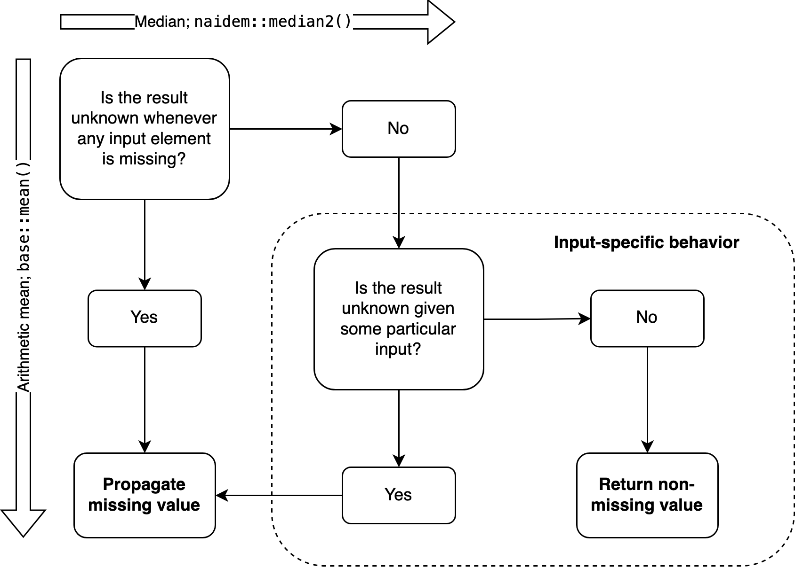

If you work with data, you most likely have to deal with missing values. You may have read that `NA` infects everything it touches --- all operations that take data with any `NA` elements will output `NA` in turn.

In R, your first reflex might be to keep those missings from ruining your analysis using `na.rm = TRUE`. If that won't do, you may even employ sophisticated imputation techniques to simulate a state where the missing values are, in fact, known.

I believe we should think differently about missing values --- at least in some cases. First of all, it's not true that `NA` propagates through all operations. Here are some counterexamples:

```{r}
NA | TRUE
NA & FALSE
```

Equivalently:

```{r}
any(NA, TRUE)
all(NA, FALSE)
```

Fine, you may think, these are logical values. Special rules apply here, and this won't work with numbers. But there is at least one case where it does:

```{r}
NA^0
```

Other cases very nearly have the same logic. `NA * 0` would be `0` if not for the possibility that `NA` hides an infinite number, because `Inf * 0` returns `NaN`. Also, `NA / 0` only is `NA` because while, e.g., `2 / 0` is `Inf`, `0 / 0` is `NaN`. If not for special values other than `NA` itself, these operations would return actual known numbers when taking `NA` as an input.

I admit that these are corner cases. They don't allow us to find, for example, the mean of a distribution where some values are missing. Importantly, however, this is just because the mean takes every single value into account. It's not a general issue with numeric operations!

## Case study: medians and missing values

The median is robust, or impervious to outliers. This statistical resilience means that some distributions have a known median *even if* some of their values are missing. A vector like `c(1, NA, 1)` has a known median, `1` --- no matter what the `NA` stands for. If `NA` is less than `1`, the true underlying distribution is sorted like `c(NA, 1, 1)`, and if it's greater, the order is `c(1, 1, NA)`.

In both cases, the central value is `1`, so the median is just as certain as in `c(0, 1, 1)` or `c(1, 1, 2)`. This logic generalizes to more complex cases, as we will see shortly. But `median()` won't tell you about any of this:

```{r}
median(c(1, NA, 1))
```

Base R contains many inconsistencies, and this is one of them. `median()` is conceptually at odds with the logical operators we saw above. It fails to implement three-valued logic correctly: if `NA | TRUE` correctly returns `TRUE`, `median(c(1, NA, 1))` should return `1`. Returning `NA` instead amounts to the assertion that the median is unknown. But it's not --- it can be determined by a median algorithm that deals with missing values correctly. I couldn't find such an algorithm in the literature, so I wrote one myself and implemented it in the [naidem](https://lhdjung.github.io/naidem/) package.

`naidem::median2()` generalizes the intuition from the simple case of `c(1, NA, 1)`. It is guaranteed to return the median if and only if the median can be determined. Whenever that's not possible, the function returns a correct and meaningful `NA`.

```{r}
library(naidem)

# Simple:
median2(c(1, NA, 1))
median2(c(1, NA, 2))

# More complex:
median2(c(3, 7, 7, 7, 8, NA, NA))
median2(c(3, 7, 7, 7, 8, NA, NA, NA))
```

The result is `NA` in two of these cases because the median really is unknown there. For `c(1, NA, 2)`, the true distribution might be `c(-4, 1, 2)` or `c(1, 2, 2)` or `c(1, 2, 50)` --- there is no way to know. Since the central value depends on the missing value, the median cannot be determined. In general, the greater the proportion of missing values and the more heterogeneous the known values, the more likely it becomes that the median is unknown due to missing values, all else being equal.

Yet it's not the same as the mean. We don't know the median, but we can use naidem to determine its minimum and maximum values. Depending on the position of `NA`, it's either `1` or `2`:

```{r}
median_bounds(c(1, NA, 2))
```

A more complex example, this time with an even number of values:

```{r}
median_bounds(c(2, 5, 4, NA, 7, NA))
```

If both `NA`s represent numbers at the vector's minimum, the true distribution is sorted like `c(NA, NA, 2, 4, 5, 7)`. The median is the mean of `2` and `4`, that is, `3`. If both unknown values are at the maximum, the order is `c(2, 4, 5, 7, NA, NA)`, so `5` and `7` are the central values. The median depends on the position of the missing values within the sorted vector, so we don't know its true value --- missingness is propagated here. But at least we know the median's range.

Some vectors have such a high share of `NA`s that the median can't be confined to a specific range. Even `median_bounds()` will return missing values, so we need a new trick.

```{r}
many_na <- c(7, 7, NA, NA, NA, NA)
median_bounds(many_na)
```

The new solution, `median_table()`, first attempts to find a non-`NA` median. If it can't, it ignores one missing value and tries again. If the result is still unknown, it will ignore one more `NA`; and so on until an estimate is found:

```{r}
median_table(list(many_na))
```

This strategy is similar to `na.rm = TRUE`, and always yields the same estimate. However, it is more careful: it only ignores as many `NA`s as absolutely necessary, so it gives us a sense of how close we are to knowing the true median of the distribution. Here, we had to ignore three out of four `NA`s, so the median is far from known. On the most basic level, the `certainty` column says whether the median is known, or whether any `NA`s needed to be ignored.

## Conceptual propagation means conditional propagation

### The basic idea

A core tenet of dealing with missing values in R says that `NA` will ["propagate conceptually"](https://stat.ethz.ch/R-manual/R-patched/library/stats/html/cor.html). This means that a function returns `NA` because the value that it's meant to compute cannot be determined from the input due to missing values. Often, a single `NA` will make the result unknown. An example is `mean()` which correctly returns `NA` whenever the input contains any `NA`: since every single value factors into the mean, the result is unknown if even a single input value is. `min()` and `max()` work the same way. (I ignore `na.rm = TRUE` here because it is just a pragmatic decision. It doesn't follow the logic of any particular algorithm.)

However, we have now seen a few exceptions. There are functions that sometimes return non-`NA` values even if their input contains missing elements. This seems just as correct as `mean()` always returning `NA` in this case. The basic reasoning is always the same: can the function answer the user's question given some particular input? With `mean()`, that's never possible. For some other functions, it depends on the input.

### What it really means

Conceptual propagation doesn't mean that each function returns `NA` whenever the input contains a missing value. Whether it should propagate `NA` depends on two parameters: (1) the function itself, and (2) certain other aspects of the input. Which aspects these are will, in turn, depend on the function. For example, `any()` won't care about `NA` elements but return `TRUE` if any other elements are `TRUE`. `all()` is precisely the reverse, looking for `FALSE` and returning it when found, despite any `NA`s there might be.

Because of these two parameters, conceptual propagation is inherently *conditional* propagation. Always responding to `NA` with another `NA` is only correct for some algorithms, like the arithmetic mean. If a function behaves this way but the answer to its question actually depends on further details about the input, as with `median()`, it seems fair to say that its implementation is not entirely correct. This is why I saw the need for an alternative that threads the needle more carefully, like `naidem::median2()`.

However, the median seems to be an exception. My sense is that most base R functions handle missing values correctly. The situation is different for modes, which are not implemented in base R. (The `mode()` function has a very different use case.) There is a package for `NA`-correct mode estimation, called [moder](https://lhdjung.github.io/moder/). I wrote it because existing community solutions didn't handle `NA` correctly, as [explained in moder's docs](https://lhdjung.github.io/moder/articles/missings.html#theory). This might seem pedantic, but functions that return `NA` imply that the result is unknown, and I think we should take this seriously.

To drive the point home, here is a protest sign:

```{r, error=TRUE, eval=FALSE}
|-------------------------|
| CONCEPTUAL PROPAGATION  |
|         MEANS           |
| CONDITIONAL PROPAGATION |
|-------------------------|
(\__/)  ||
(•ㅅ•)  ||
/ 　 づ
```

### A general agenda for specific questions

When writing functions that may return `NA`, we should apply domain-specific logic to determine the precise conditions where it's appropriate. What makes the data unfit to answer the function's question? For many functions, this will be a single `NA`. Yet we can only know this by considering the specifics of the algorithm at hand. The median is different from the mean in this respect, and so is the mode.

The details of this can be complex. But we need to face this complexity head-on to keep the semantics of `NA` consistent, and to justify the assertions that we imply when our functions return missing --- or known --- values.

This flowchart encapsulates the agenda for designing algorithms that deal with missing values correctly:



## More assumptions, more information

The picture changes if we assume some context about the missing values. Imputation methods are the typical form of this, but a particularly interesting example is a recent [variation on Kendall's tau](https://www.biorxiv.org/content/10.1101/2022.02.24.481854v2) by Robert Flight and others. This algorithm derives information from missing values under certain domain-specific assumptions. It is similar in spirit to [Codd's four-valued logic](https://towardsdatascience.com/richer-missing-values-dea7377f5541) which differentiates between missing values based on whether they are "applicable" or not: does their missingness have any substantive implications for the question at hand or can they safely be ignored?

If the assumptions of these more demanding models are met, we know a little more about `NA`s than just their count and their individual positions in the data. This can translate into higher information value for certain operations, but relying on such knowledge narrows the scope of the techniques.

Codd's system also differs from all the above because it cares about the specifics of individual missing values. Every single missing value is encoded as either applicable or inapplicable. This is quite foreign to R, which only uses the more generic `NA` placeholder. The R functions I discussed before don't rely on any specific assumptions beyond the idea that certain values are unknown. This is why they are less demanding and more general tools.

Note that the positions of missing values within the distribution are *prima facie* irrelevant because taking them into account would require domain-specific assumptions about how to interpret them. Apart from the number of missing values, there is no information about `NA`s that can readily be used --- that is, without incurring such assumptions.